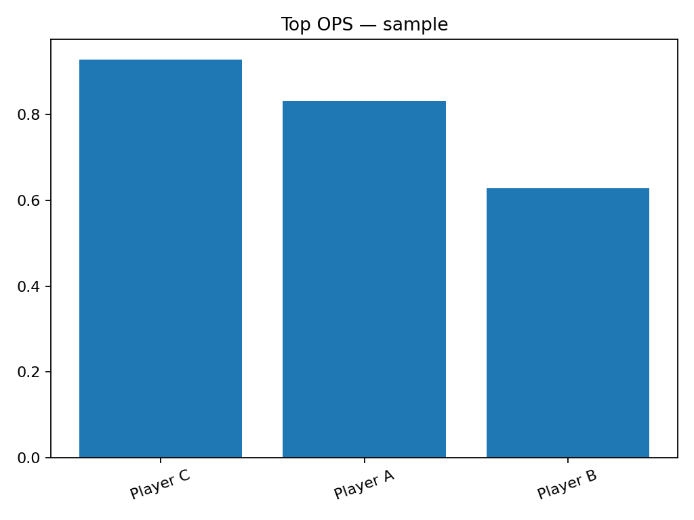

# Seattle Mariners KPI Analysis

Compute core hitter KPIs (AVG/OBP/SLG/OPS) from a small sample and produce a ranked summary and a bar chart. The aim here is clarity and a clean starting point.

## Quickstart
```bash
python3 -m venv .venv && source .venv/bin/activate
python -m pip install --upgrade pip
python -m pip install -r requirements.txt
make quickstart
```

Outputs will appear in `reports/tables/` and `reports/figures/`.

## What I learned
- Keep calculations simple and NA-safe first, then iterate.
- Make small, testable steps and produce artifacts (CSV/PNG) every run.
- Write down decisions so future changes are easier to review.

## Decisions & next steps
- Start with a small sample so the pipeline is easy to run.
- OPS is a clear first step; later I want to add wOBA, park adjustments, and better visuals.
- Roadmap: expand data, add better metrics, and tighten tests as I go.

## Preview
After `make quickstart`, you should see a CSV table and one PNG in `reports/`.


